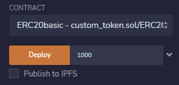
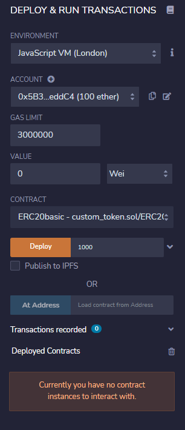
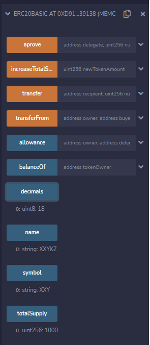

# ERC20Basic
Una sencilla implementacion del contrato ERC20.

Abrimos Remix , creamos una nueva carpeta que llamaremos custom_token, dentro creamos un archivo que se llame ejemploNombre.sol, dentro copiaremos el contenido de ERC20.sol
En nuestra nueva carpeta creamos otro archivo que llamaremos SafeMath.sol donde importaremos una implementacion abreviada de esta libreria.

Utilizamos un compilador que sea >=0.4.4 <0.7.0

# Modificacion de los datos de nuestro token
Si queremos cambiar el nombre, symbol o decimales de nuestro token modificaremos las siguientes variables en nuestro ejemploNombre.sol.

        //nombre de nuestro token
        string public constant name = "XXYKZ";
        //symbol de nuestro token
        string public constant symbol = "XXY";
        //decimales de nuestro token
        uint8 public constant decimals = 18;
        
Una vez que hayamos finalizado nuestra propia implementacion del estandar ERC20 podemos compilarlo y deployarlo.

Nos dirigimos al menu de compilacion de remix y utilizamos un compilador entre las versiones mencionadas.

# Deploy de nuestro contrato

En nuestro contrato tendremos el constructor de nuestro smart contract, el cual recibe como parametro el supply (la cantidad) de tokens que generaremos.

        constructor(uint256 initialSupply) public {
            totalSupply_ = initialSupply;
            balances[msg.sender] = totalSupply_;
        }

Luego le administramos el supply en de nuestro token en el constructor con el input "supply".

Una vez realizado, seleccionamos el entorno de despliegue de nuestro contrato, en este caso utilizaremos la VM London.

Con todo esto seteado estamos listos para desplegar nuestro contrato y generar nuestro token.

Todo listo, ya creaste tu token ERC20 😎😎😎.
